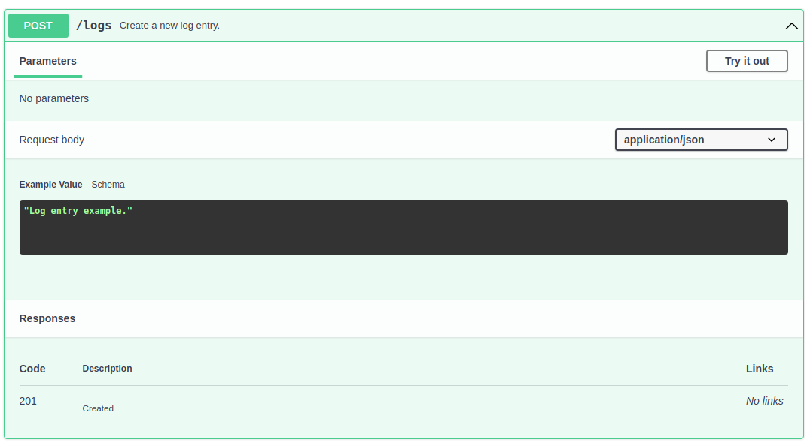

# Verify database content from a karate test.

[](https://github.com/42talents/blog-verify-database-content-from-a-karate-test/actions/workflows/maven.yml)

When you develop some API and write acceptance tests, database content often needs to be verified.
This blog post will teach you how to validate the database content from the karate test.

The example uses [spring-boot](https://spring.io/projects/spring-boot), [karate](https://github.com/karatelabs/karate) and [testcontainers](https://www.testcontainers.org).


<sub>
Photo by <a href="https://unsplash.com/@nci?utm_source=unsplash&utm_medium=referral&utm_content=creditCopyText">National Cancer Institute</a> on <a href="https://unsplash.com/s/photos/database-check?utm_source=unsplash&utm_medium=referral&utm_content=creditCopyText">Unsplash</a>
</sub>


## What is the Karate Framework?

Karate's slogan is **Test Automation Made Simple**. It is a test framework based on Cucumber to write web application tests quickly. You can use it as an alternative to REST-assured API testing.

You write Karate tests in Gherkin. The following example shows the request to create a new log entry and verify the return code 202.

```gherkin
Scenario: Create a new log entry
  Given url baseUrl + '/logs'
  And request "example log entry d9175765-f8eb-4fb1-a98e-2359ef5a75f2"
  When method post
  Then status 202
```

### Karate Setup within a Spring-Boot Project

Karate comes as a test dependency. In this example, we use maven.

```xml
<dependency>
    <groupId>com.intuit.karate</groupId>
    <artifactId>karate-junit5</artifactId>
    <version>1.2.0</version>
    <scope>test</scope>
</dependency>
```


## Example API

The example API features a POST call to the /logs resource to create a log entry, but the API features no way to read the log with the API.




A simple acceptance test could look like the following example.

```gherkin
Scenario: Create a new log entry
  Given url baseUrl + '/logs'
  And request "example log entry d9175765-f8eb-4fb1-a98e-2359ef5a75f2"
  When method post
  Then status 202
```

But this only checks the return code and does not verify that the log entry exists in the database.


### Database access from karate

The karate framework has the feature of calling java code from the test.

You can use this feature to write some utility class that gives you access to the database.

Writing specific methods in a particular utility class is better because the test should be easy to read and understand. For example, the following shows a test that verifies the database content using the utility class `dbutils.LogDatabase`.

```gherkin
Background:
  * def LogDatabase = Java.type('dbutils.LogDatabase')
  * def logDb = new LogDatabase(postgresConfig)

Scenario: Create a new log entry
  * def entry = 'example log entry d9175765-f8eb-4fb1-a98e-2359ef5a75f2'
  Given url baseUrl + '/logs'
  And request entry
  When method post
  Then status 202
  And match true == logDb.hasEntry('example log entry d9175765-f8eb-4fb1-a98e-2359ef5a75f2')
```

In the background section, the database utility is configured and initialized. In the scenario, there is an additional step to verify the log entry in the database. Now, let's take a look at the implementation.


```java
public class DbUtility<T> {

  private final JdbcTemplate jdbc;

  public DbUtility(Map<String, Object> config) {
    String url = (String) config.get("url");
    String username = (String) config.get("username");
    String password = (String) config.get("password");
    String driver = (String) config.get("driverClassName");
    DriverManagerDataSource dataSource = new DriverManagerDataSource();
    dataSource.setDriverClassName(driver);
    dataSource.setUrl(url);
    dataSource.setUsername(username);
    dataSource.setPassword(password);
    jdbc = new JdbcTemplate(dataSource);
  }

  protected List<T> readRows(String query, Class<T> elementType, Object... args) {
    return jdbc.query(query, new BeanPropertyRowMapper<T>(elementType), args);
  }

  protected int update(String sql, Object... args) {
    return jdbc.update(sql, args);
  }
}
```

The `DbUtility` class initializes the database connection and provides methods to query rows and execute updates.
The specialization `LogDatabase` extends the `DbUtility` and provides specific methods for the test scenarios.

```java
public class LogDatabase extends DbUtility<Log> {

  public LogDatabase(Map<String, Object> config) {
    super(config);
  }

  public boolean hasEntry(String text) {
    List<Log> logEntries = readRows("select id from log where text=?", Log.class, text);
    return logEntries.size() > 0;
  }
}
```


### Test data preparation

It is a best practice to prepare the system under test with a particular test. Currently the `LogDatabase` utility uses `logEntries.size() > 0` to verify that a log entry is written. Better would be `logEntries.size() == 1`.
To execute the test repeatedly, we have to remove an eventual existing log entry.

A new method on the `LogDatabase` utility is required to support this.

```java
public int deleteEntries(String text) {
    return update("delete from log where text=?", text);
  }
```

And we can call this method at the start of the test scenario. For example, the following statement calls the delete entry method and logs the result to the console.

```gherkin
  * karate.log('removed', logDb.deleteEntries(entry), 'log entries')
```

The complete, repeatedly executable scenario now looks like this.

```gherkin
Scenario: Create a new log entry
    * def entry = 'example log entry d9175765-f8eb-4fb1-a98e-2359ef5a75f2'
    * karate.log('removed', logDb.deleteEntries(entry), 'log entries')
    Given url baseUrl + '/logs'
    And request entry
    When method post
    Then status 202
    And match true == logDb.hasEntry('example log entry d9175765-f8eb-4fb1-a98e-2359ef5a75f2')
```

This way, the feature is usable repeatedly during development and in the continuous integration pipeline tests.


### Conclusion

The possibility of calling Java code from the Karate test gives you all the power you need to test your API and even beyond the API's interfaces.


The complete example source code is available on our [GitHub Repository](https://github.com/42talents/blog-verify-database-content-from-a-karate-test).

If you are interested to learn more about Karate and Spring Boot, [get in touch and have a look at our training courses!](https://42talents.com/en/training/in-house)

Happy coding with ❤️ from Bern.